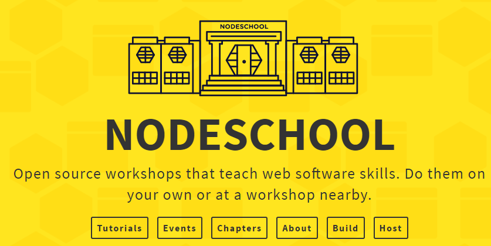
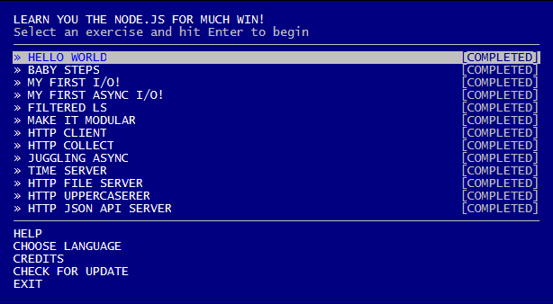
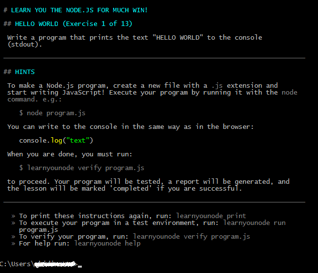
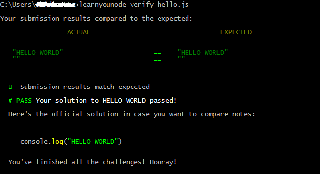

class: center, middle

# Node.js Self-Learning Practices

.center[Andrey Bidinotto]

.center[[@ 4th Node.js Porto Alegre Meetup - March 14, 2017](https://github.com/node-poa/Meetups/blob/master/meetups/04.md)]

---

# .center[Why Self-Learning practices?]

.center[]

???

All right, the above picture is a great sum up, present an overview about the essential on Node.js learning path. The importance to demonstrate it has a tremendous impact on developers daily basis, furthermore, it also depends on previous experience and knowledge background under the hoods. So the initial steps on this self-learning practices are really strategic and needs a special attention on the planning of it.

---

***Hmmm, ok, I have no idea in node.... Is this MEAN.js tutorial good?***

.center[]

???

Unfortunately it isn't a good practice to get the hands dirty skipping the basics.

---

### .center[The core is important => ]

+ ***Node.js Runtime Architecture*** (the core, event-loop, non-blocking I/O and basic API)
+	***Node.js LTS and Semver*** (versions and its timeline)
+	***Node.js essential tools*** (npm and git)
+	***Javascript core*** (prototype, closures, currying, native APIs, etc...)

???

In case these steps were ignored somehow, it certainly would cause frustration to any developer that really wants to build something quickly as promised in a cool tech talk. In fact, experienced programmers states that it's really easy and fast to build & deploy a Node.js web application, <strong>an universal truth</strong>, period.</p>

---

### .center[Keep it simple approach]

.center[]

???

So, the assumption regarding the steps after getting the basics on Node.js knowledge (4 topics above) is that the learning curve depends on its developers goals, e.g.: build a web application, develop a micro-service thru a REST API, build a CLI tool or automate something using Raspeberry.

---

### Open self-learning technologies are simple and straightforward

## E.g.:
.center[]

???

---

### Learnyounode case: easy setup

```
$ npm install -g learnyounode

$ learnyounode
```

.center[]

???

---

### Learnyounode case: easy learning

.center[]

???

---

### Learnyounode case: easy coding & testing

***hello.js***
```javascript
console.log('HELLO WORLD');
```

Then let learnyounode to test it for you:

```javascript
$ learnyounode verify hello.js
```
.center[]

???

As noticed these CLI tools enable developers from any background level to improve their knowledge skills on Node.js platform and related web development practices. There are several on line coding courses that you might have played (Code School, CodeAcademy, Egg Head, etc...) and you must pay to continue, in other hand the open source and documentation you can easily find out in github repositories.

---

# .center[Strategy is essential]

.center[]

---

# Self-learning practices

+ Continuously read Node.js API (https://nodejs.org/api/).
+ Read the source code of your app dependencies, curiosity helps you.
+ Create your node.js playground repo.
+ Play with Node.js REPL to test any piece of code.
+ Read news and articles from reliable sources (e.g.: Twitter, LinkedIn).
+ Found a bug? Contribute.
+ Missing module on npm? Implement and publish it.
+ Participate on JS related events or watch them on youtube.
+ Read good books.
+ Evaluate your knowledge with tricky interview questions.
+ Create your own study backlog.

---

# Self-learning practices in a nutshell

.center[]

---

# .center[References]

+ [https://medium.freecodecamp.com/before-you-bury-yourself-in-packages-learn-the-node-js-runtime-itself-f9031fbd8b69#.hzbbehn5f](https://medium.freecodecamp.com/before-you-bury-yourself-in-packages-learn-the-node-js-runtime-itself-f9031fbd8b69#.hzbbehn5f)
+ [https://nodeschool.io/#workshoppers](https://nodeschool.io/#workshoppers)
+ [https://bitbucket.org/ecore/node-js-track](https://bitbucket.org/ecore/node-js-track)

---

# .center[Thank you! :)]

## .center[ [@andreymoser](http://twitter.com/andreymoser)]
