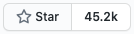
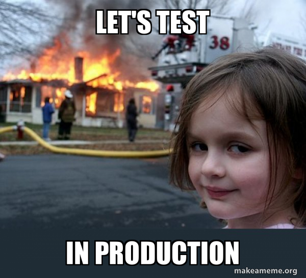
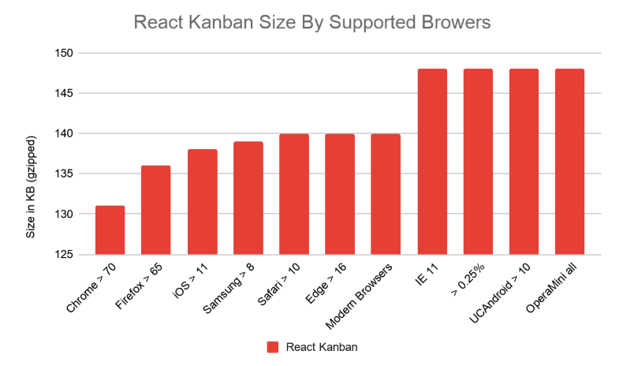

class: center, middle

# 🏁 🏎️ 

## Web Apps Performance: Técnicas e Otimizações

.center[Andrey Bidinotto]
.center[Software Engineer [@PoaTek](https://github.com/PoaTek) | Startup Founder]

---

## Sobre mim e a escolha do tema

--

+ 15 anos de programação e aprendizados em backend, frontend e arquitetura.

--

+ **Ago/2019**: Desenvolvimento ContractsPro - Contract Manager for Jira

--

+ **Nov/2019**: Problemas de Performance no ContractsPro | TDC POA Frontend

--

+ **Jan/2020**: 🚀 ContractsPro v1.0.2 (Jira Server): https://mindproapps.com

--

+ **Abr-Set/2020**: Desenvolvimento ContractsPro Cloud Beta (Jira Cloud)

--

+ **Out-Nov/2020**: [@PoaTek](https://poatek.com/) | C4P TDC POA Frontend

--

  + Por que não relatar minha experiência destes últimos 12 meses?

---

# Antes de começar

```terminal
git commit -m 
"Talk renomeada para Web Apps Performance: Técnicas e Otimizações para SPA & SSG"
```
--

+ Foco em **Single Page Applications (SPA)**

--

  + **SPA**s que usam **Static Site Generation (SSG)** no processo de build

--

+ Sem explorar o **Server Side Rendering (SSR)** por hoje 😢

--

+ Mas pode ser muito útil também para **SSR** 🤟

---

# Performance depende do contexto

--

.center[]

---

class: middle

.center[# E o contexto depende de JS ❤️]

.center[<span></span>]

---

# 🍿 Time Bomb Dev - Temporada 1

--

### `Ep 1: As dependências fantásticas 🤗`

--

+ `É popular` 

--

+ `API acessível, simples e coesa`

--

+ `É estável, issues em dia, bem testada e documentada com muitos contribuidores`

--

+ `Aumenta a produtividade no desenvolvimento`

--

.center[]

---

# 🍿 Time Bomb Dev - Temporada 1

--

### `Ep 2: E a complexidade aumenta`

--

+ `Implementação do relatório gráfico`

--

+ `Mais uma dependência fantástica para os gráficos`

--

+ `Projeto sendo executado conforme o planejado`

--

+ `Pipeline estruturado + ESLint/TSLint`

--

+ `"Nada pode dar errado neste projeto..."`

--

.center[]


---

# 🍿 Time Bomb Dev - Temporada 1


.center[]

---

# 🍿 Time Bomb Dev - Temporada 1

--

### `Ep 3: Ué, acho que o Chrome travou... 🤨`

--

+ `Ambiente de testes, homologação apresentam os primeiros sintomas, parece ser intermitente...`

--

+ `Ambiente de dev parece tudo bem... 🧐`

--

+ `2 escolhas: ignorar ou investigar o problema?`

.center[]

--

+ `Claro que investigar! 🧐`

---

# 🍿 Time Bomb Dev - Temporada 1

### `Ep 4: O primeiro milhão de bytes`

--

+ `Bundle gerado (*.min.js) com 1MB 😱`

--

+ `Static Bundle Analyzer e Resultados 🔍`

--

```markdown
       |-----|----------------------------|
       | 10% | Funcionalidades do projeto |
       |-----|----------------------------|
       | 90% | Dependências do projeto    |
       |-----|----------------------------|
```
--

## `⚠️ SPOILER ALERT ⚠️` 

--

> No fim das contas dá tudo certo, vamos ver o que pode ser feito para evitar isso!

---

# Como ficar de olho na Performance 🚀

--

+ Static Bundle Analyzers

--

+ Code Splitting

--

+ Lazy Loading / Dynamic imports

--

+ Biblioteca de Componentes

--

+ Aspectos Interessantes

--

+ Estratégias para a mudança


---

# Static Bundle Analizers 🔍

--

.center[]
[<font size="3">`Demo: Webpack Bundle Analyzer`</font>](https://www.npmjs.com/package/webpack-bundle-analyzer)

---

# Configurando o webpack-bundle-analyzer

--

Exemplo com webpack (v4):

```bash
$ npm install --save webpack-bundle-analyzer
```

--

Integrando ao webpack:

```js
const { BundleAnalyzerPlugin } = require('webpack-bundle-analyzer');
 
module.exports = {
  plugins: [
    new BundleAnalyzerPlugin()
  ]
}
```

---

# Code Splitting

--

`app-bundle.min.js (100KB)` (Sem Code Splitting)


--

_Code splitting baseado em features:_

--

`  |__ main-app.min.js (~10KB)`

> `💲 Home & Feature Principal`

--

`  |__ vendors-core.min.js (~30KB)`

> `⚙️  Dependências básicas (SPA) e comuns a todos os componentes`

--

`  |__ feature-report.min.js (~20KB)`

> `📊 Relatórios gráficos`

--

`  |__ vendors-report.min.js (~40KB)`

> `📊 Dependências dos relatórios gráficos`

---

# Code Splitting na prática (Webpack)

--

`Webpack config (v4) com code splitting default`

--

  + main.min.js (features + basic SPA dependency)
  + vendors.min.js (dependencies)

--

```json
optimization: {
  splitChunks: {
    cacheGroups: {
      commons: {
        test: /[\\/]node_modules[\\/]/,
        name: 'vendors',
        chunks: 'all'
      }
    }
  }
}
```

--

### Mas como faço code splitting como no slide anterior?

---

# Lazy Loading + Code Splitting

--

### Exemplo:

`/main-app.min.js (Home + Feature principal)`

--

`/vendors-core.min.js (Dependências comuns a todas as features)`

--

`/feature-report.min.js (Relatórios)`

--

`/vendors-reports.min.js (Biblioteca usada pelos relatórios)`

--

`1. Usuário acessa "/"`

--

+ `Carrega "main-app.min.js" e "vendors-core.min.js"`

--

`2. Usuário acessa "/relatorios"`

--

+ `Carrega "feature-report.min.js" e "vendors-reports.min.js"`

--

---

# Lazy Loading usa Dynamic Imports

É uma especificação do [ES6](https://github.com/tc39/proposal-dynamic-import):

--

```js
import('any-dependency'); // Promise esperando carregamento da dependência
```

--

+ Hoje é suportado em 92,23% dos browsers modernos
  + https://caniuse.com/?search=import

--

Com Webpack e o exemplo no slide anterior:

```js
import(
  /* webpackChunkName: "reports" */
  './reports'
); // carrega dependência neste bundle: "vendors-reports.min.js"
```

---

## Lazy Loading na prática (React v16.6+)

--

[<font size="3">`/src/LazyReportsComponent.js`</font>]()
```js
import React from 'React';

const LazyReportsComponent = React.lazy(() => 
  /* webpackChunkName: "reports" */
  import('./reports'));

default export LazyReportsComponent;
```

--

[<font size="3">`/src/ReportsView.jsx`</font>]()
```js
import React, { Suspense } from 'react';
import LazyReportsComponent from './LazyReportsComponent';

default export class ReportsView extends React.Component {
  render() {
    return (
      <div>
        <Suspense fallback={<div>Loading Reports...</div>}>
          <LazyReportsComponent />
        </Suspense>
      </div>
    )
  }
}
```

---

# Tenha sua Biblioteca de Componentes 📚

--

+ Revisão de todas as dependências (por um Static Bundle Analyzer)

--

+ Troque dependências pesadas por **mais novas e leves (seguindo os mesmos critérios de uma dependência fantástica 🤓)**

--

  + Um belo exemplo: o próprio **moment.js** argumenta para não usar mais ele em novos projetos (https://momentjs.com/docs/#/-project-status/).

--

+ Repita sempre os passos anteriores (event-loop feelings)

---

# Alguns aspectos interessantes

--

+ É ótimo para Micro-Frontends **bem estruturados** 

--

+ Comunidade ativa no desenvolvimento de dependências leves

--

+ _"**CSS/Styles in JS**"_ é um desafio a ser resolvido em performance.

--

+ O tamanho do bundle depende do _target_ e _polifyl_ (ES5 > ES6)

--

.center[]
.center[[https://www.debugbear.com](https://www.debugbear.com/blog/how-does-browser-support-impact-bundle-size)]

---

# E o minify, o cache e gzip?

--

+ São boas práticas que não devem ser ignoradas e são **obrigatórias**.

--

+ A maioria dos frameworks e empacotadores utilizam estas práticas por padrão (minify/uglify) ou possuem plugins para o mesmo.

--

+ Cache é necessário no browser, mas atenção:

--

  + Fique atento ao nome que você utiliza ao seus assets.

--

  + Sempre procurar utilizar um identificador único por release (exemplo: hash).

--

    + Exemplo: main-**976b281694de4045c9a032254a2f0c8b**.min.js

--

+ O Gzip encoding depende da infraestrutura utilizada.

---

# Legal, como eu convenço meu chefe? 💼

--

+ Em grande escala, possibilita uma margem de lucro maior

--

+ Aumento da probabilidade de vendas

--

+ Acessibilidade (nem todos os momentos temos 5G disponível)

--

+ Cliente Satisfeito e recorrente

--

+ Aumento na qualidade do produto

--

+ Diminuição de issues de infraestrutra em Produção

--

.center[]

---

# Não deu certo, o que eu faço? 🥺

---

# Não deu certo, o que eu faço? 🤔

+ Crie um Dev Story

--

+ Faça uma planejamento estratégico

--

+ Priorize o backlog do Dev Story de forma estratégica

--

+ E continue mostrando a importância da performance

--

.center[]

---

# Algumas referências 🤓

--

+ https://pt-br.reactjs.org/docs/code-splitting.html

--

+ https://medium.com/reactbrasil/code-splitting-e-lazy-loading-em-react-b1ce9870289f

--

+ https://webpack.js.org/guides/code-splitting/

--

+ https://www.npmjs.com/package/webpack-bundle-analyzer

--

+ https://github.com/tc39/proposals/blob/master/finished-proposals.md

--

+ https://github.com/tbleckert/react-select-search

--

+ https://github.com/bidicode/react-light-components


---

# Perguntas? 🤔

---

# .center[Obrigado! 😀]

## .center[ [andreymoser.github.io](https://andreymoser.github.io)]

## .center[ [@andreymoser](http://twitter.com/andreymoser)]
