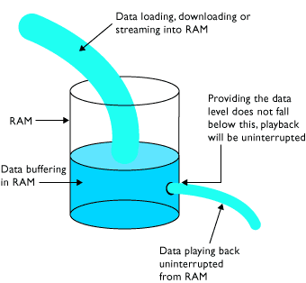
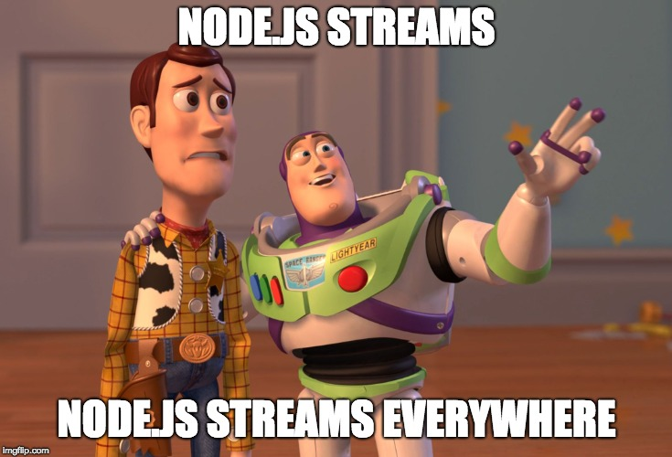

class: center, middle

# Node.js Streams as a piece of cake 🍰

.center[Andrey Bidinotto]
.center[Software Architect @ [e-Core](http://twitter.com/ecoreBR) | Startup Founder]
.center[ [@andreymoser](http://twitter.com/andreymoser)]


.center[Talk presented to:]
.center[[TDC Porto Alegre on Dec 2018](http://www.thedevelopersconference.com.br/tdc/2018/portoalegre/trilha-nodejs)]
.center[[Node.js POA Meetup on Nov 2018](https://www.meetup.com/pt-BR/Node-js-Porto-Alegre-Meetup/events/255164211/)]

---

# Why streams?

.center[]

???

Notes...

# Advantages
- Memory efficiency: you don’t need to load large amounts of data in memory before you are able to process it.
- Time efficiency: it takes way less time to start processing data as soon as you have it, rather than waiting till the whole data payload is available to start.

# Disadvantages
- Debugging and troubleshooting complexity
- Asynchronous handling paradigm

---

# Stream (Computer Science)

.center[]

> > "Stream is a sequence of data elements made available over time." (Wikipedia)

???

Notes...

---

# Stream and buffer example

.center[<br>*copyright: http://www.planetoftunes.com*
]

???

Notes...

---

# Node.js Streams talk topics

--
- Source & Destination (I/O)

--
- Data (object mode)

--
- Stream buffering

--
- Event Emitters

--
- Stream Types

--
- Readable stream 

--
- Writable stream

--
- Streams and pipes

--
- Stream and promises

--
- Highland 

???

Notes...

---

# .center[Source & Destination (I/O)]

.center[]

???

Notes...

---

# Data: `objectMode`

- String

```javascript
stream.write('hello stream');
```

- Buffer

```javascript
stream.write(Buffer.from('hello stream'));
```

- Custom types (except for `null`)

???

Notes...

---

# Stream buffering

- ### Backpressuring
  * `highWaterMark` mechanism

.center[]

???

Notes...

---

# .center[Event Emitters]

.center[]

```node
stream.on('readable', console.log('next chunk is available'));
stream.on('data', data => console.log(`chunk read: ${data.toString()}`));
stream.on('end', () => console.log('finished: read the whole data'));
stream.on('error', (err) => console.error(err));
``` 

???

Notes...

---

# Node.js stream types

- ### 👀 Readable: *read data (1 source)*
--

- ### ✍️ Writable: *write data (1 destination)*
--

- ### ↔️ Duplex: *readable and writeable (2 sources and 2 destinations)* 
--

- ### 🦋 Transform: *duplex calculated*

???

Notes...

---

# 👀 Readable stream (download example)

```node
const https = require('https');

https.get('https://speed.hetzner.de/100MB.bin', (download) => {
  download.on('data', data => console.log(data));
  download.on('end', () => console.log('done'));
}).on('error', console.error);
```

???

Notes...

---

# 🚰 Readable & Writeable streams

> [HTTP Server example from node.js docs](https://nodejs.org/api/stream.html#stream_stream)
```node
const http = require('http');
const server = http.createServer((req, res) => {
  // req is a Readable Stream & res is a Writable Stream
  let body = '';
  req.setEncoding('utf8');
  // Readable streams emit 'data' events once a listener is added
  req.on('data', (chunk) => {
    body += chunk;
  });
  // the 'end' event indicates that the entire body has been received
  req.on('end', () => {
    try {
      const data = JSON.parse(body);
      data.message = 'Hello world';
      res.writeHead(200, { 'Content-Type': 'application/json' });
      res.write(JSON.stringify(data));
      res.end();
    } catch (er) {
      res.statusCode = 400;
      return res.end(`error: ${er.message}`);
    }
  });
});
server.listen(9000);
```
---

# 👨‍🔧 Pipes: Readable & Writeable streams

```node
const http = require('http');
const https = require('https');

const server = http.createServer((req, res) => {
  https.get('https://speed.hetzner.de/100MB.bin', (download) => {
    download.pipe(res);
  }).on('error', (err) => {
    console.error(err);
  });
});
server.listen(9000);
```

---

# Node.js streams...

--

.center[]

---

# Success cases 🚀

- HTTP/S requests and responses (`http` and `https` modules)

--
- File system (`fs` module)

--
- Chats using sockets (TCP connection using duplex stream with `net` module)

--
- MongoDB streams (`db.find({})`)

--
- AWS S3 upload and download streams

--
- Producer and consumers (via RabbitMQ, Kafka, ActiveMQ, etc...)

--
- And so on...

--

???

Notes...

---

# Stream and promises case #1

> Consumer stream bad practice (no backpressuring to promise)

```node
const { db, handlerAsync, subscribeTopic } = require('./app');

const consumer = subscribeTopic('abc');

consumer.on('data', message =>
  db.find({ _id: message._id }).then(data => handlerAsync(data)));
```

???

Notes...

---

# Highland library

- https://github.com/caolan/highland
- http://highlandjs.org/#backpressure

Everything can be converted and tied to streams! 🚀

--

```node
const _ = require('highland');

_([1, 2, 3, 4])
  .on('data', console.log)
  .on('end', () => console.log('done'));
```

--


output >>
```node
1
2
3
4
done
```
---

# Stream and promises case #2

> Consumer stream good practice (there is backpressuring to promise)

```node
const _ = require('highland');

const { db, handlerAsync, subscribeTopic } = require('./app');

const consumer = subscribeTopic('abc');

function myPromise(message) {
  return db.find({ _id: message._id })
    .then(data => handlerAsync(data));
}

_(consumer)
  .flatMap(message => _(myPromise(message)))
  .stopOnError(err => console.error(err))
  .done(() => console.log('done'));
```

---

# Troubleshooting, debugging and other tips

- Pause the source stream for multiple piping, resume after all pipes
- Use logging (debug level) libraries for all events in data flow
- Add relevant data to debugging
- 3rd parties streams migth not follow the standard events
- Be aware about the 3rd parties libraries version

???

Notes...

---

# Interesting topics

- Events for Readable, Writeable and Duplex streams
- Readable and Writeable stream implementation
- Several streams piping (e.g.: upload file to HTTP server -> count data -> apply checksum -> zip content -> upload to S3 and store reference to database)
- The `stream` module and its `pipeline` method
- The 4 streams versions (they are backward compatible)

---

# References

- https://en.wikipedia.org/wiki/Stream_(computing)
- https://nodejs.org/api/stream.html
- https://nodejs.org/en/docs/guides/backpressuring-in-streams/
- https://medium.freecodecamp.org/node-js-streams-everything-you-need-to-know-c9141306be93
- https://www.slideshare.net/sspringer82/streams-in-nodejs
- https://codeburst.io/nodejs-streams-demystified-e0b583f0005
- https://flaviocopes.com/nodejs-streams/
- http://www.planetoftunes.com/computer/caching-and-streaming.html
- http://highlandjs.org/#backpressure
- https://medium.com/the-node-js-collection/a-brief-history-of-node-streams-pt-1-3401db451f21
- https://medium.com/the-node-js-collection/a-brief-history-of-node-streams-pt-2-bcb6b1fd7468

---

# Q & A


???

Notes...

---

# .center[Thank you! :)]

## .center[ [@andreymoser](http://twitter.com/andreymoser)]

## .center[ [andreymoser.github.io](https://andreymoser.github.io/talks/nodejs-streams-as-a-piece-of-cake)]
